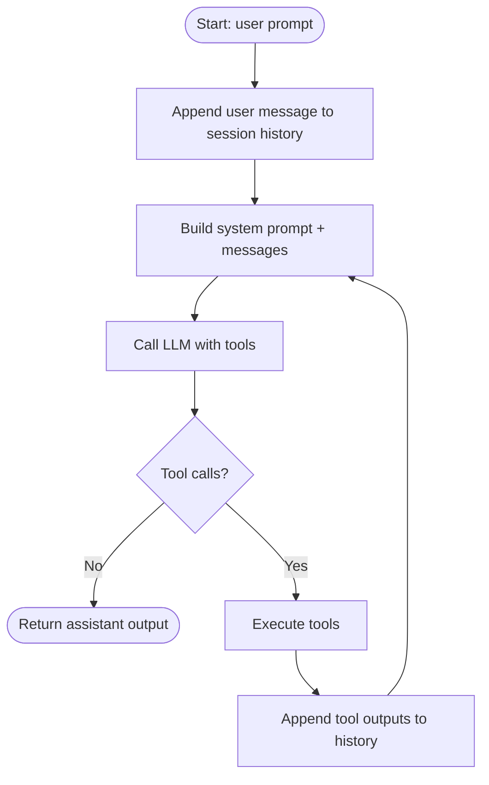

# Meto Architecture

## 1. Overview

**Meto** is a minimal “coding agent” CLI built around a single, repeatable **LLM tool-calling loop**. The core idea is:

- The **CLI** collects user input (interactive REPL or one-shot stdin).
- The **Agent Loop** calls an LLM with (system prompt + conversation history + tool schemas).
- If the LLM requests tools, the **Tool Runner** executes them and feeds results back into the loop.
- A **Session** persists history (and lightweight task tracking) to enable continuity across turns and across CLI runs.

Architecturally, Meto is designed for:

- **Separation of concerns**: tool *schema* vs tool *execution*; CLI vs loop; prompt building vs history storage.
- **Extensibility** via filesystem-discovered artifacts:
  - user-defined **agents** (`.meto/agents/*.md`)
  - custom **slash commands** (`.meto/commands/*.md`)
  - modular **skills** (`.meto/skills/*/SKILL.md`)
- **Safety posture**: interactive permission prompts for sensitive tool calls (with an opt-out “YOLO” mode).

```mermaid
flowchart LR
  U[User] -->|interactive input / stdin| CLI[CLI (Typer + prompt_toolkit)]

  CLI -->|prompt| LOOP[Agent Loop<br/>model/tool-calling cycle]
  LOOP -->|messages + tool schemas| LLM[LLM via OpenAI SDK<br/>(often through LiteLLM proxy)]
  LLM -->|assistant message + tool_calls (optional)| LOOP

  LOOP -->|dispatch tool_calls| TOOLS[Tool Runner<br/>tool execution]
  TOOLS -->|shell / fs / network / subagent| OS[(Local OS & Environment)]
  TOOLS -->|tool output| LOOP

  LOOP <--> SESS[Session<br/>history + todos + mode]
  SESS -->|JSONL persistence| STORE[(~/.meto/sessions)]
  SESS -->|plan artifacts| PLANS[(~/.meto/plans)]
```

## 2. Main Components

### 2.1 CLI / User Interaction Layer

**Primary responsibility:** provide a terminal UX for interacting with the agent.

Key capabilities:

- **Interactive mode**: REPL-style input with prompt customization (e.g., plan mode prefix).
- **One-shot mode**: reads stdin once, runs the agent loop, prints output, exits.
- **Slash commands**:
  - built-in commands (e.g., help, sessions, context, todos, plan/done)
  - custom commands loaded from `.meto/commands/*.md`

Relevant modules:

- `src/meto/cli.py`
- `src/meto/agent/commands.py`


### 2.2 Agent Runtime Configuration

**Primary responsibility:** define an “execution context” for a run of the loop:

- agent name (e.g., main, explore, plan, code)
- which tools are available (allowlist / “all tools”)
- max turn budget
- whether lifecycle hooks are enabled
- whether permission prompts are skipped (“YOLO”)

Important architectural concept:

- **Main agent**: stateful; reuses a session across user prompts.
- **Subagents**: isolated; run in fresh sessions; used for scoped subtasks.

Relevant modules:

- `src/meto/agent/agent.py`
- `src/meto/agent/agent_registry.py`

```mermaid
flowchart LR
  REG[Agent Registry] -->|defines| AGTYPES[Agent Types<br/>explore / plan / code / ...]
  AGTYPES -->|tool allowlist + prompt| AGENT[Agent (runtime context)]
  AGENT -->|uses| SESSION[Session]
  AGENT -->|exposes| TOOLS[Tool Schemas]
```

### 2.3 Agent Loop (LLM ↔ Tools Orchestration)

**Primary responsibility:** run the core iterative loop:

- build model input (system prompt + history)
- call the LLM
- execute requested tools
- append tool results back into history
- stop when the model returns no tool calls (or when max turns is reached)

This is the “engine room” where **control flow** lives.

Relevant modules:

- `src/meto/agent/agent_loop.py`
- `src/meto/agent/prompt.py` (system prompt assembly)



### 2.4 Prompt Construction & Project Instructions

**Primary responsibility:** build a consistent system prompt each turn by combining:

- a base “agent operating manual” prompt
- repository instructions (from `AGENTS.md`)
- optional session mode fragments (e.g., plan mode)

This allows the runtime to reflect changes in `AGENTS.md` without restarting.

Relevant modules:

- `src/meto/agent/prompt.py`
- `AGENTS.md`


### 2.5 Tooling Subsystem (Schema vs Execution)

Meto splits tools into two halves:

1) **Tool Schemas (model-facing)**

**Primary responsibility:** define the JSON schema exposed to the LLM (names, descriptions, parameters).
Design constraint: keep it **import-light** and free of runtime-heavy dependencies.

2) **Tool Runner (runtime execution)**

**Primary responsibility:** implement the behavior of each tool request, including:

- shell execution
- filesystem read/write and directory listing
- grep/search
- fetching URLs
- todo updates
- spawning subagents
- prompting user questions (interactive)

Relevant modules:

- `src/meto/agent/tool_schema.py`
- `src/meto/agent/tool_runner.py`


### 2.6 Sessions, History Persistence, and Context Export

**Primary responsibility:** store and manage:

- conversation history (OpenAI-style message list)
- a session identifier
- persistence to **JSONL** on disk
- lightweight task list (“todos”)
- current session “mode” (optional)

Additionally, Meto can export and summarize history for debugging and sharing.

Relevant modules:

- `src/meto/agent/session.py`
- `src/meto/agent/context.py`
- `src/meto/agent/todo.py`


### 2.7 Modes (Interactive State Machines)

**Primary responsibility:** provide optional UX + prompt shaping modes attached to a session, such as **Plan Mode**:

- custom prompt prefix (e.g., `[PLAN] >>>`)
- additional system prompt instructions
- mode-owned artifacts (plan file under `~/.meto/plans`)

Modes are intentionally small and composable.

Relevant modules:

- `src/meto/agent/modes/base.py`
- `src/meto/agent/modes/plan.py`


### 2.8 Extensibility: Agents, Commands, Skills

Meto supports “content-defined behavior” via Markdown + YAML frontmatter:

- **User-defined agents**: `.meto/agents/*.md`
  - define descriptions, tool allowlists, and prompt text
  - user agents can override built-ins

- **Custom slash commands**: `.meto/commands/*.md`
  - provide prompts (with optional tool restrictions and optional “fork/subagent” context)

- **Skills**: `.meto/skills/*/SKILL.md`
  - discoverable metadata at startup
  - full content loaded on demand and injected into the conversation as “domain expertise”

Relevant modules:

- `src/meto/agent/agent_registry.py`
- `src/meto/agent/commands.py`
- `src/meto/agent/skill_loader.py`
- `src/meto/agent/frontmatter_loader.py`


### 2.9 Hooks & Permission Policy (Safety / Governance)

**Permission Policy**

**Primary responsibility:** decide which tool calls require user confirmation before execution. The default stance is conservative, especially for filesystem operations outside known safe directories.

Relevant module:

- `src/meto/agent/permission_policy.py`

**Hooks System**

**Primary responsibility:** run configurable lifecycle hooks (shell commands) at extension points:

- session_start
- pre_tool_use
- post_tool_use

Hooks can observe structured input via environment variables and can optionally block tool execution (policy/gating).

Relevant module:

- `src/meto/agent/hooks.py`


### 2.10 Configuration / Infrastructure

**Primary responsibility:** centralized configuration through environment variables (prefixed `METO_`) with `.env` support. Includes:

- LLM API key and base URL (commonly a LiteLLM proxy)
- default model name
- tool timeouts and output truncation limits
- directories for sessions, plans, agents, commands, skills, hooks config

Relevant module:

- `src/meto/conf.py`

```mermaid
flowchart LR
  ENV[Environment variables<br/>METO_*] --> CFG[Settings (pydantic-settings)]
  DOTENV[.env file] --> CFG
  CFG --> LOOP[Agent Loop]
  CFG --> RUNNER[Tool Runner]
  CFG --> PATHS[Filesystem paths<br/>sessions/plans/agents/commands/skills]
```

## 3. Component Relationships

### 3.1 End-to-End Request Lifecycle

At runtime, the system follows a predictable control flow:

1. User enters a message (or a slash command expands into a message).
2. CLI invokes the Agent Loop with an agent context (main or subagent).
3. Agent Loop sends messages + tool schemas to the LLM.
4. If tool calls are returned, Tool Runner executes them (subject to permission policy and hooks).
5. Tool results are appended to history and the loop continues.
6. When no tool calls are returned, output is printed and control returns to the CLI.


### 3.2 Slash Commands and “Prompt as Configuration”

Slash commands act as a routing layer:

- Built-ins execute immediate actions (e.g., show help, show todos).
- Custom commands load prompt text from disk; optional frontmatter can:
  - restrict tools
  - request execution via a forked agent/subagent context


### 3.3 Subagents as Isolation Boundaries

Subagents are spawned to keep complex subtasks isolated from the main session history:

- fresh session (clean slate)
- restricted tool access (by registry allowlist)
- bounded max turns
- output is returned to the caller as tool output and can be summarized/used by the main agent

```mermaid
flowchart LR
  MAIN[Main Agent Loop] -->|run_task tool| SUB[Subagent (fresh session)]
  SUB -->|its own loop| LLM2[LLM]
  SUB -->|tooling| TOOLS2[Tools (restricted)]
  SUB -->|final text output| MAIN
```

## 4. Mermaid Diagrams

This document includes Mermaid diagrams for:

- Overview: overall architecture
- Main components: CLI routing, agent loop iteration, prompt assembly, schema vs runtime tools
- Relationships: end-to-end sequence, slash command flow, subagent isolation
- Optional context: repository layout and data artifacts

(All Mermaid blocks are tagged with `mermaid` for rendering.)

## 5. File Structure & Data Flow (Optional)

### 5.1 Repository Layout (Conceptual)


### 5.2 Primary Data Artifacts

- **Session logs**: append-only JSONL files under `~/.meto/sessions/`
- **Plan artifacts**: markdown files under `~/.meto/plans/`
- **User extensibility** (in the repo/workdir):
  - `.meto/agents/` (agent definitions)
  - `.meto/commands/` (custom command prompts)
  - `.meto/skills/` (skills library)
  - `.meto/hooks.yaml` (hooks config)

```mermaid
flowchart LR
  WORKDIR[(Current working directory)] --> USERCFG[.meto/* (user extensions)]
  USERCFG --> UA[agents/]
  USERCFG --> UC[commands/]
  USERCFG --> US[skills/]
  USERCFG --> UH[hooks.yaml]

  HOME[(User home)] --> SESSDIR[~/.meto/sessions/]
  HOME --> PLANDIR[~/.meto/plans/]

  LOOP[Agent Loop] --> SESSDIR
  MODE[Plan Mode] --> PLANDIR
  REG[Agent Registry] --> UA
  CMD[Commands] --> UC
  SKL[Skills] --> US
  HOOKS[Hooks] --> UH
```

## 6. Instructions

- This document is intentionally **architecture-focused** and avoids implementation-level details.
- It describes **components, responsibilities, and interactions** using stable file/module boundaries.
- All diagrams are provided as **Mermaid** blocks to enable rendering in Markdown viewers that support Mermaid.
